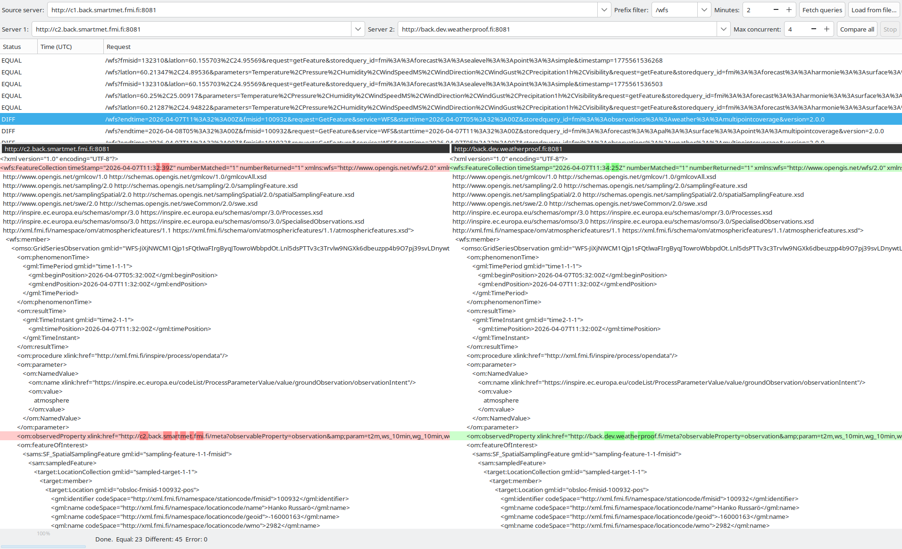

GUI application to compare responses of 2 SmartMet server instanses.
(GTKMM)[https://gtkmm.gnome.org/en/index.html] version 3 is used for GUI.
Application may get requests
- by reading them from text file (one request per line with host part removed)
- by reading them from a SmartMet server access log (one log entry per line;
  all `GET` / `POST` / `HEAD` entries are imported regardless of HTTP status)
- by fetching last requests of specified number of minutes from SmartMet server (note requires admin access to backend server, which should normally be blocked outside local network)

Sample screenshot of application:

## Keyboard shortcuts

Application-wide (work regardless of focus):

| Shortcut | Action                                     |
| :------- | :----------------------------------------- |
| Ctrl+O   | Load request list / access log from file   |
| Ctrl+F   | Fetch queries from the source server       |
| Ctrl+R   | Compare all queries                        |
| F5       | Compare all queries                        |
| Escape   | Stop the running fetch or comparison       |
| Ctrl+Q   | Quit                                       |

Text-diff view (when either diff pane has keyboard focus):

| Shortcut  | Action                     |
| :-------- | :------------------------- |
| Tab       | Jump to the next difference     |
| Shift+Tab | Jump to the previous difference |
| F3        | Jump to the next difference     |
| Shift+F3  | Jump to the previous difference |

On opening a text comparison the view scrolls automatically to the first
difference.

## Request list — row context menu

Right-clicking a row shows:

- **Copy request (decoded)** — the URL-decoded request path + query
- **Copy request (original)** — the raw request string as received from the log
- **Send request to both servers…** — re-sends the request to both configured
  servers and opens a modal with a `curl -v` style transcript (request
  headers, response status + headers, and body) in a notebook, one tab per
  server.
- **Send request to Server 1…** / **Send request to Server 2…** — same, but
  hits only the selected server and shows a single-tab transcript.
