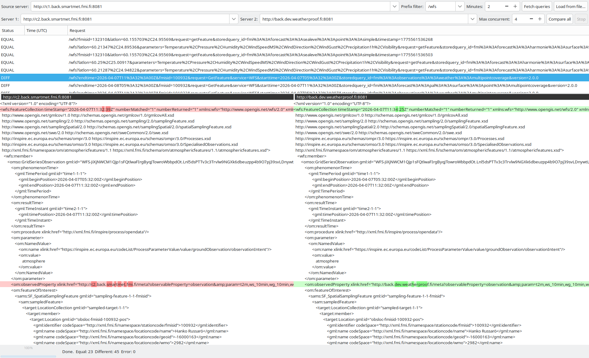

GUI application to compare responses of 2 SmartMet server instanses.
(GTKMM)[https://gtkmm.gnome.org/en/index.html] version 3 is used for GUI.
Application may get requests
- by reading them from text file (one request per line with host part removed)
- by reading them from a SmartMet server access log (one log entry per line;
  all `GET` / `POST` / `HEAD` entries are imported regardless of HTTP status)
- by fetching last requests of specified number of minutes from SmartMet server (note requires admin access to backend server, which should normally be blocked outside local network)

The current request list can also be exported back to a text file via
**Save filtered…**.  The export contains exactly the rows visible through
the active filter, so the typical workflow for reproducing differences is:
run a full comparison, set the status filter to **Different**, click
**Save filtered…**, and re-load the resulting file to re-test only those
queries.

**Rerun filtered** does the same re-test without leaving the application
and without discarding anything: it re-sends only the rows visible through
the active filter and leaves the results of all other rows as they are.
So one can, for example, run a full comparison, filter to **Different**,
click **Rerun filtered** to see whether those differences are reproducible
(or just cache content), and afterwards click **Compare all** to re-test
the complete set against a changed server pair — for instance first test
against production, then two servers of the same production cluster
against each other.

While a comparison runs, the status line shows the running tally
(`Comparing 120/500…  Equal: 100  Different: 15  Error: 5`).  For a
partial re-run it shows the statistics of the re-run subset first and the
statistics of the whole request list after a `|` separator.

Sample screenshot of application:

## Keyboard shortcuts

Application-wide (work regardless of focus):

| Shortcut | Action                                     |
| :------- | :----------------------------------------- |
| Ctrl+O   | Load request list / access log from file   |
| Ctrl+F   | Fetch queries from the source server       |
| Ctrl+R   | Compare all queries                        |
| F5       | Compare all queries                        |
| Escape   | Stop the running fetch or comparison       |
| Ctrl+Q   | Quit                                       |

Text-diff view (when either diff pane has keyboard focus):

| Shortcut  | Action                     |
| :-------- | :------------------------- |
| Tab       | Jump to the next difference     |
| Shift+Tab | Jump to the previous difference |
| F3        | Jump to the next difference     |
| Shift+F3  | Jump to the previous difference |

On opening a text comparison the view scrolls automatically to the first
difference.

## Text-diff view — collapsed by default

Only the differing lines and a few unchanged lines around each of them are
shown; every skipped run is replaced by a single `⋯ N lines hidden ⋯`
marker.  Filling the panes with a multi-megabyte response otherwise takes
seconds of staring at a frozen window, and the interesting part is a
handful of lines out of thousands.

Two controls in the diff toolbar:

- **Full text** — render the complete responses instead.  Slow for large
  responses; the setting is remembered between sessions.
- **Context** — how many unchanged lines are kept above and below each
  difference (3 by default).

The label beside them reports how much is hidden.  Note that in-pane
search (Ctrl+F) only covers what is actually rendered, so switch to
**Full text** to search a whole response.

## Request list — row context menu

Right-clicking a row shows:

- **Copy request (decoded)** — the URL-decoded request path + query
- **Copy request (original)** — the raw request string as received from the log
- **Send request to both servers…** — re-sends the request to both configured
  servers and opens a modal with a `curl -v` style transcript (request
  headers, response status + headers, and body) in a notebook, one tab per
  server.
- **Send request to Server 1…** / **Send request to Server 2…** — same, but
  hits only the selected server and shows a single-tab transcript.
